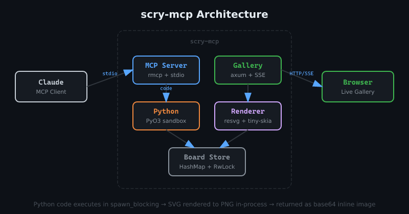
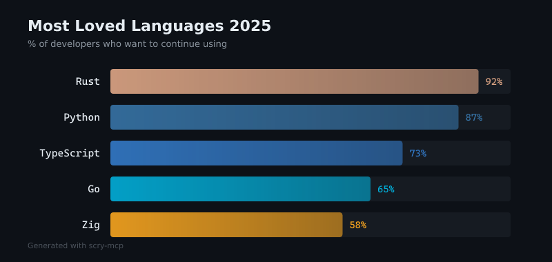
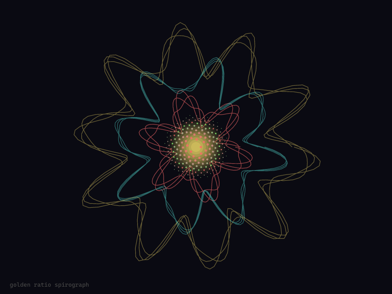
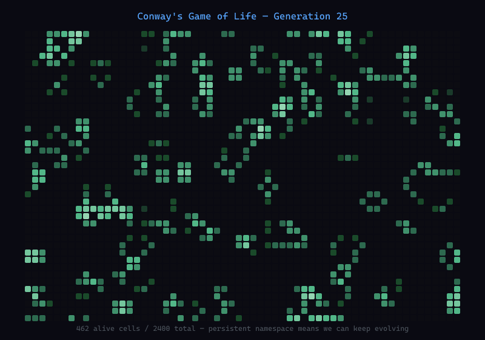

<p align="center">
  
</p>

Computational scrying glass — an MCP server that lets Claude generate SVG visuals via Python code, render them to PNG, and serve them in a live web gallery.

## Architecture



## Tools

**`whiteboard`** — Execute Python code to generate SVG visuals on a named board. Call `svg('<svg>...</svg>')` to set content. Variables persist between calls.

**`whiteboard_list`** — List all active boards with thumbnails, URLs, and metadata.

## Requirements

- **Rust** 1.85+ (edition 2024)
- **Python 3.x** with development headers (PyO3 embeds CPython at build time)
- **System fonts** — resvg uses fontdb to load system fonts for text rendering

Built and tested on **Arch Linux** (kernel 6.18, Python 3.14, Rust 1.90). Should work on other Linux distros and macOS but hasn't been tested yet — reports welcome.

## Install

```
cargo install scry-mcp
```

Or build from source:

```
git clone https://github.com/tobert/scry-mcp
cd scry-mcp
cargo build --release
```

On Debian/Ubuntu you may need `python3-dev` for PyO3:

```
sudo apt install python3-dev
```

### Add to Claude Code

```
claude mcp add -s user scry -- /path/to/scry-mcp --address 127.0.0.1 --port 3333
```

Or if installed via `cargo install`:

```
claude mcp add -s user scry -- scry-mcp --address 127.0.0.1 --port 3333
```

Or manually add to your MCP config:

```json
{
  "mcpServers": {
    "scry": {
      "command": "scry-mcp",
      "args": ["--address", "127.0.0.1", "--port", "3333"]
    }
  }
}
```

## Usage

Once configured, ask Claude to use the whiteboard tool:

> "Draw a red circle on a white background using the whiteboard tool"

The gallery is live at http://localhost:3333/gallery/ — it auto-refreshes via SSE when boards update.

### CLI Options

```
scry-mcp [OPTIONS]

Options:
      --address <ADDRESS>  Gallery bind address [default: 127.0.0.1]
      --port <PORT>        Gallery port [default: 3333]
```

## Python Environment

Each board gets a persistent Python namespace with these pre-imported:

`math`, `random`, `json`, `re`, `textwrap`, `itertools`, `functools`, `collections`, `colorsys`, `hashlib`, `string`, `dataclasses`

`WIDTH` and `HEIGHT` are set to board dimensions (default 800x600).

Dangerous modules (`os`, `subprocess`, `socket`, etc.) are blocked.

## Examples

All of these were generated by Claude using scry's `whiteboard` tool.

### Data Visualization



### Generative Art



### Simulation


